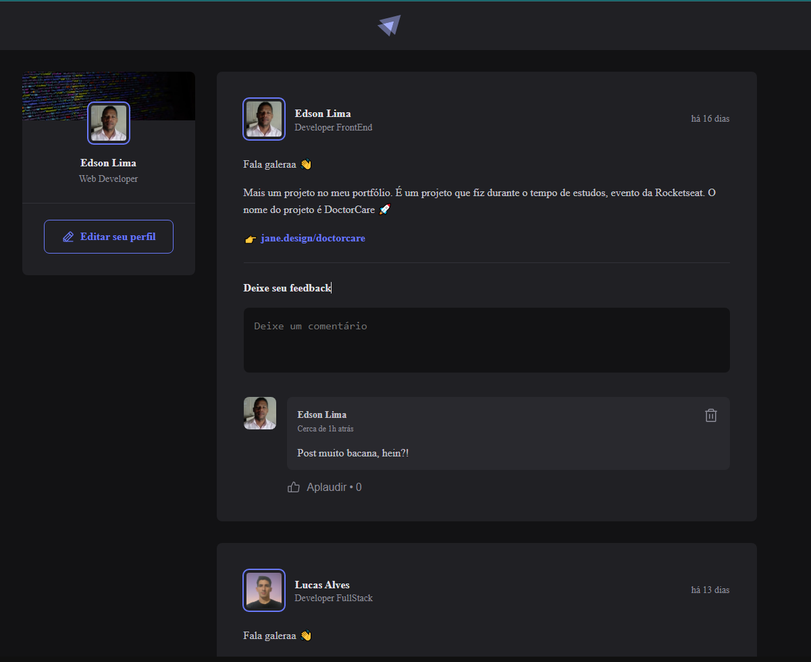
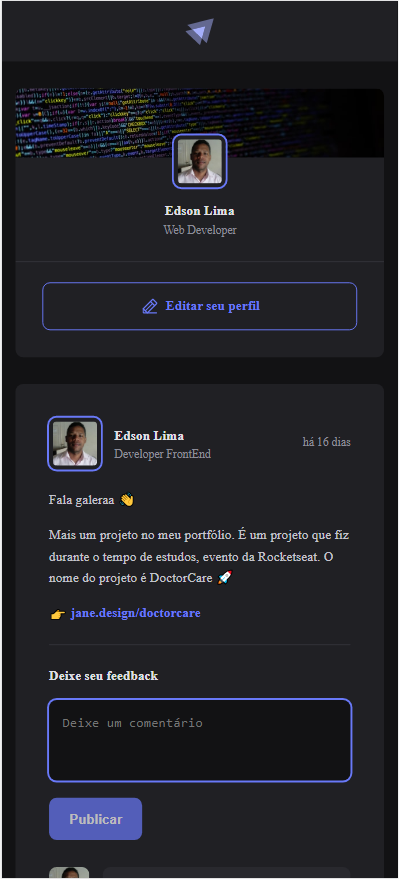

# Primeiro Projeto: VB Social

## Objetivo com esse projeto é estudar a estrutura basica de um projeto feito em ReactJS:

- Components
- Props
- Hooks(useState)
- CSS Module
- Como iniciar projeto com Vite
- Organização de projetos em ReactJS
- Imutabilidade

## Aprendi sobre:

- Clean Code
- Aplicando padrões de acessibilidade
- Como iniciar projeto com TypeScrips e fundamentos.
- Aplicar tipagem estática à aplicação.

---

# First Project: VB Social

## Objective with this project is to study the basic structure of a project made in ReactJS:

- Components
- Props
- Hooks(useState)
- CSS Module
- How to start project with Vite
- Organization of projects in ReactJS
- Immutability

## I learned about:

- Clean Code
- Enforcing accessibility standards
- How to start a project with TypeScripts and fundamentals.
- Apply static typing to the application

### View Web

	
			

### View Responsive Mobile

	
			

